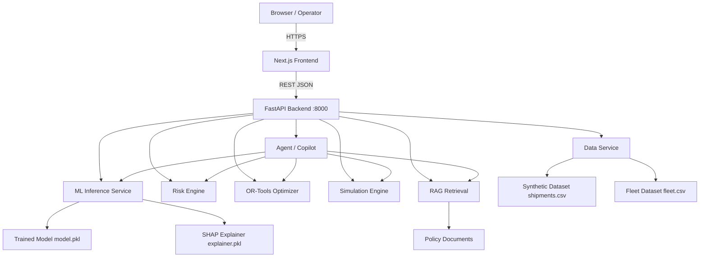

# Architecture

## System Architecture

## Components

| Component | Technology | Responsibility |
|---|---|---|
| Frontend | Next.js 14, React, TypeScript, Tailwind CSS, Recharts | Executive dashboard, risk center, fleet optimizer, what-if simulator, AI copilot |
| Backend API | FastAPI, Pydantic, Python 3.11 | Business logic, request validation, service orchestration |
| ML Pipeline | scikit-learn, XGBoost, Pandas, NumPy | Disruption classification, delay estimation, model training/inference |
| Explainability | SHAP | Per-shipment feature attribution and root-cause factor ranking |
| Risk Engine | Python (deterministic) | Composite risk scoring combining ML output, priority, and deadline pressure |
| Fleet Optimizer | Google OR-Tools (CP-SAT / linear solver) | Capacity-constrained vehicle-to-shipment assignment optimization |
| Simulation Engine | Python (deterministic) | What-if scenario recalculation without persistent state mutation |
| Agentic Copilot | Python agent loop with tool dispatch | Natural-language question → tool selection → structured response |
| RAG | TF-IDF retrieval over policy documents | Operational policy lookup for copilot answers |

## Data Flow

### Shipment Risk Prediction
1. Shipment feature vector is extracted from the dataset (or provided directly by API caller)
2. Feature vector is preprocessed (scaling, encoding) by the preprocessing pipeline
3. ML classifier outputs disruption probability and expected delay
4. SHAP explainer computes per-feature contribution values
5. Risk engine combines ML output with priority and deadline context to produce a risk score and level
6. API response includes: risk score, risk level, disruption probability, expected delay, and ranked contributing factors

### Fleet Optimization
1. Current fleet status and active shipment list are loaded
2. OR-Tools constraint model is constructed: one assignment per shipment, capacity constraints, availability constraints, deadline feasibility
3. Solver minimizes total operating cost while maximizing priority coverage
4. Solution is returned as ranked assignments with cost and utilization statistics
5. Unassignable shipments (infeasible constraints) are flagged explicitly

### Agentic Copilot Query
1. User submits a natural-language question
2. Agent analyzes intent and selects appropriate tool(s): get_shipments, predict_delay, calculate_risk, analyze_root_cause, get_fleet_status, optimize_fleet, run_simulation
3. Selected tools are invoked sequentially or in dependency order
4. Tool results are collected and combined with relevant RAG context
5. Agent produces a structured response: what was checked, what was found, recommended action, numerical evidence

### What-If Simulation
1. User specifies modified parameters (weather, traffic, congestion, fleet availability)
2. Simulation engine clones the current operational state
3. Modified parameters are applied to each affected shipment
4. ML inference is re-run on the modified feature vectors
5. Aggregate metrics are computed for both current and simulated states
6. Side-by-side comparison is returned: disruption probability delta, delay delta, cost delta, utilization delta, high-risk count delta

## Security Considerations

- All secrets (API keys, database credentials) are stored in environment variables via `.env` — never committed to git
- `.env.example` documents required variable names with placeholder values
- No authentication bypass or hardcoded credentials exist in the codebase
- The backend validates all inputs via Pydantic models before processing

## Scalability Notes

The FastAPI backend is stateless with respect to individual requests; horizontal scaling behind a load balancer is feasible. The ML model is loaded once at startup and reused across requests. The OR-Tools optimizer is CPU-bound; for production scale, optimization jobs would be queued asynchronously. The synthetic dataset can be replaced with a PostgreSQL-backed data layer without changing the service interfaces.
